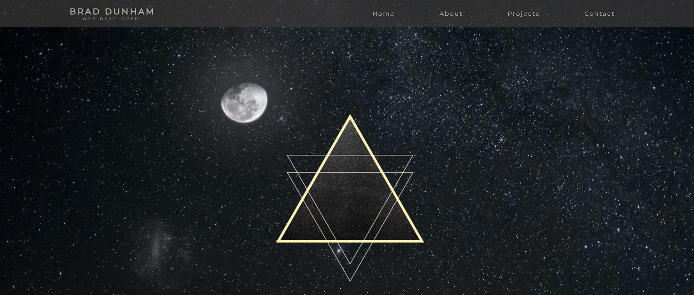

# <h1 align="center">port_3  </h1>
## <h2 align="center">React App Portfolio</h2>

## Technologies 🤖

## Description
My personal portfolio recreated in React. Site is responsive and has a functional contact form.

Deployed to GitHub Pages <a href="https://bdunham484.github.io/port_3/">here</a>!

### Made with ❤️ by  Brad Dunham

